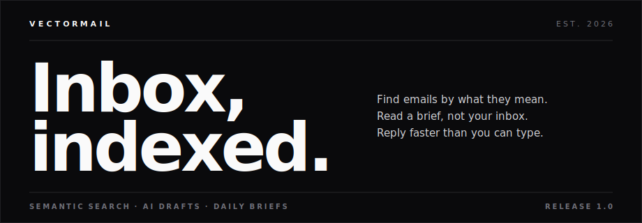
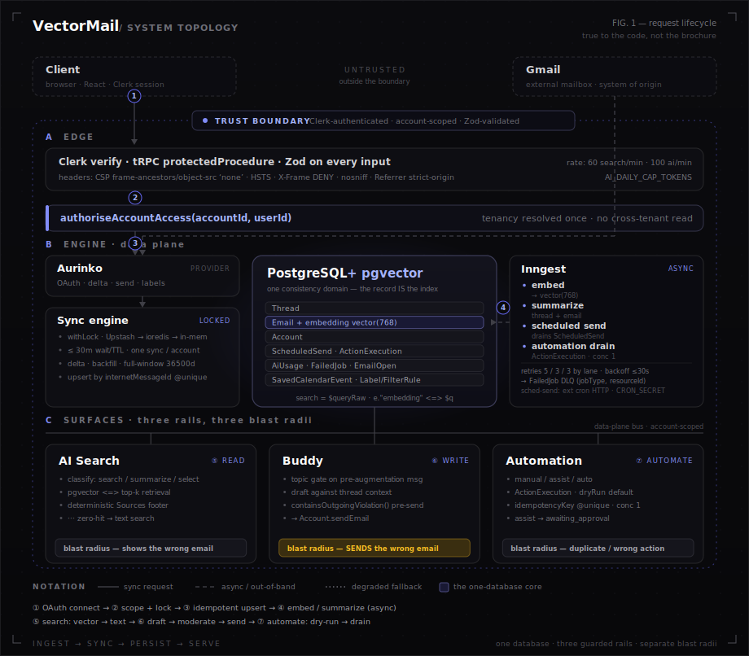

<div align="center">



# VectorMail

**Semantic Gmail client on one Postgres - reads, writes, and automation each run on their own guarded rail.**

[Live demo](https://vectormail.space) · [Portfolio](https://parbhat.dev)

</div>

Email is a database problem with an AI surface, not the reverse.

## The problem

Email is the largest structured corpus most people own, and almost none of it is searchable by what it means. "The invoice Sarah flagged last week" is a trivially human query and a hopeless keyword query - the words "invoice" and "flagged" may appear nowhere in the thread. Semantic retrieval is the obvious fix, but it drags two harder problems behind it: where the vectors live, and what happens when AI touches the *outbound* path instead of just the read path.

Most "AI email" products get both wrong. They bolt a chat box onto a mail client and let the model draft and send with no gate, which turns a hallucination into a delivered message. And they stand up a separate vector database next to the system of record, which means dual writes, re-embedding drift, and tenant scoping enforced in two places instead of one. VectorMail is built on the opposite bet: keep meaning in the same database as the mail, and give reading, writing, and automating their own rails with their own guarantees - because those three operations have wildly different blast radii.

## Thesis

### One stack, one database

Embeddings live on the `Email` row as a `vector(768)` column, and search is a parameterized `$queryRaw` using pgvector's `<=>` cosine operator, scoped by `accountId` in the same `WHERE` clause that enforces tenancy. There is no separate vector store, no sync job between the system of record and an index, no second place to get scoping wrong.

The usual objection is that a dedicated vector DB scales further. True at billions of vectors - irrelevant at per-account email volume, where the working set is thousands of rows behind an `accountId` filter. What you give up in theoretical ANN throughput you get back in having exactly one consistency domain: when a thread is deleted or re-labeled, its vectors are already gone, because they were never anywhere else.

When an embedding is missing, the query degrades to text search rather than failing - covered below. The point of the architecture is that "search" is a SQL query against the same tables everything else reads, not a distributed-systems problem.

### Two AI surfaces, one inbox

Reading and writing get different rails because a bad read shows you the wrong email and a bad write sends one. **AI Search** is the read rail: it classifies intent (search / summarize / select), answers with a deterministic **Sources** footer (subject, sender, date, snippet) so every claim is traceable, and keeps lightweight session memory so "summarize that one" resolves. It is instructed never to invent amounts or dates and never to offer to send.

**Buddy** is the write rail, and it is guarded twice. A topic gate runs a regex blacklist on the user's *pre-augmentation* message - math, code, recipes, trivia, weather all bounce before a token reaches the model - so the drafting surface can't be turned into a general chatbot. Then, immediately before `Account.sendEmail`, subject and body pass through `containsOutgoingViolation()`: word-boundary patterns for slurs, threats, sexual violence, CSAM, drug trade, and fraud. The model is upstream of the gate, not trusted to be the gate.

### Demo mode as architectural commitment

The demo isn't a fixture set behind a feature flag. The tRPC context rewrites `ctx.auth.userId` to `DEMO_USER_ID` (`trpc.ts:31`), and every account-scoped procedure resolves demo data through the same `isDemoCall` check - no forked controllers, no parallel "demo router."

This is a deliberate test of the real boundary. A demo that runs through the production resolver exercises the production auth and account-scoping path; if scoping were broken, the demo would leak too. It also means a procedure can't accidentally support real users while silently breaking in demo, because there is only one path. The cost - every account procedure carries a demo branch - is the honest price of not maintaining two code paths that drift.

### Delta-first sync, account-locked

Sync runs in three modes, all behind a per-account lock. Incremental sync uses Aurinko delta tokens. First-time and gap-fill use a list-pagination backfill that walks the mailbox newest-to-oldest, gated on `Account.inboxBackfilledAt`. A full-window fetch (`SYNC_WINDOW_DAYS = 36500`, effectively all-time) runs on force-sync or an empty inbox. The lock (`sync-lock.ts`) guarantees one sync per account at a time; correctness here is the unglamorous heart of the product, and §"Why this is hard" goes deeper.

### Automation is opt-in, idempotent, reversible

Automation has three modes on the account - `manual`, `assist`, `auto` - and every automated action is an `ActionExecution` row that is `dryRun` by default. `assist` parks the action in `awaiting_approval` until a human confirms; `auto` requires explicit opt-in plus a running worker. An `idempotencyKey @unique` makes double-execution a database error rather than a duplicate send, and the Inngest handler runs at concurrency 1 per execution.

The obvious alternative is "let the model autosend above a confidence threshold." That is irresponsible at any real scale: confidence is not calibrated, retries double-fire, and there is no audit trail when it's wrong. The opinion encoded here is that an automated send needs three things before it's allowed to exist - a dry run, an idempotency key, and an approval gate - and the default is to simulate, not send. "Reversible" means exactly that: nothing leaves by default, assist is human-gated, and an execution can be cancelled before it runs. It does not mean a sent email can be un-sent.

## Architecture

<div align="center">



</div>

A request flows in one direction. Gmail is reached only through Aurinko, so OAuth, delta sync, send, and labels are one integration surface. Sync acquires the per-account lock, then writes threads and emails into Postgres; analysis jobs attach summaries and the `vector(768)` embedding out of band via Inngest. Every read past this point - `getThreads`, search, Buddy context - goes through `authoriseAccountAccess`, so tenancy is resolved once, server-side. The three surfaces sit on top of the same tables: AI Search queries embeddings, Buddy drafts against thread context then passes the moderation gate, and Automation writes `ActionExecution` rows the worker drains. Labels and filter rules are persisted per account (user-defined filing), and calendar events are extracted from mail into `SavedCalendarEvent` for the "Upcoming" view - both are stored artifacts off the same Email rows, not separate services.

## Why this is hard

- **Sync correctness is the whole game.** The lock (`withLock`, up to a 30-minute wait/TTL, Upstash → ioredis → in-memory) is the easy part. The subtle part: backfill completion was originally inferred from "has a delta token," so an account whose token was set early would stall with months of mail missing. Completion is now an explicit `inboxBackfilledAt` timestamp, set only when the list walk reaches the oldest message - and an inbox that isn't backfilled yet is *not* delegated to the background worker, because the worker returns `background: true` with no continuation token and the client can't drive the walk. That single missing fallback was the difference between "syncs" and "silently stops at last week."
- **Idempotent ingestion.** Every email upserts by `Email.internetMessageId @unique`. Provider redeliveries, retried syncs, and overlapping delta windows converge on one row instead of duplicating threads.
- **Automation that cannot double-fire.** `ActionExecution.idempotencyKey @unique` plus per-execution Inngest concurrency of 1 means a retry storm produces a uniqueness violation, not three sent emails. Permanent failures land in a `FailedJob` DLQ keyed by `(jobType, resourceId)`.
- **Search that degrades instead of erroring.** `vector-search.ts` falls back to text search on three conditions: a zero query embedding, zero vector hits, or any pgvector error. Search returning weaker results beats search throwing.
- **Bounded AI spend.** Per-user limiters (`SEARCH_LIMIT_PER_MINUTE = 60`, `AI_LIMIT_PER_MINUTE = 100`) cap rate; `AI_DAILY_CAP_TOKENS` caps daily cost by summing input+output tokens from the `AiUsage` table before each call. One user or one bug can't run up an unbounded bill.
- **Gmail mangles plaintext.** Buddy drafts are plain text; sent naively, Gmail collapses them into one unbroken block. Before send, the body is converted to inline-styled HTML - `\n\n` → `<p>`, numbered lines → `<ol>`, `**bold**` → `<strong>` - so a drafted email actually arrives as a structured email.

## Design decisions & tradeoffs

- **pgvector over a dedicated vector DB.** *Why:* one consistency domain; tenancy is a `WHERE` clause. *Tradeoff:* not billion-vector ANN - acceptable at per-account scale.
- **Sync on user action, no background polling.** *Why:* stays inside Aurinko/Gmail rate limits, no idle load. *Tradeoff:* not live; relies on first-sync plus manual sync.
- **AI is optional.** *Why:* the default deploy runs with zero AI keys - connect, sync, list, send all work. *Tradeoff:* without keys, search degrades to text and compose/summaries are off.
- **In-memory lock fallback.** *Why:* single instance runs with no Redis dependency. *Tradeoff:* multi-instance coordination requires Redis; the in-memory lock is per-process only.
- **Dry-run automation by default.** *Why:* safety over autonomy. *Tradeoff:* real autosend needs explicit opt-in and a running worker - there is no one-click "let it rip."

## Failure modes

- **Redis down or unreachable.** Lock acquisition retries for up to 30 minutes, then throws. Once Redis is selected there is no silent downgrade to the in-memory lock - failing loud beats running two syncs.
- **Inngest down or unconfigured.** Sync and inbox reads are unaffected; scheduled sends and embedding/summary jobs queue until it returns.
- **LLM provider down.** Compose and summaries surface errors; search falls back to text so the read path keeps working.
- **Aurinko rate limit / auth error.** The account's `needsReconnection` flag is set and the UI prompts a reconnect; sync resumes after re-auth or limit reset.
- **Cron not firing.** Due `ScheduledSend` rows stay `pending` until the next successful tick - no send is lost, just delayed.
- **Embedding job fails repeatedly.** 5 retries with exponential backoff, then a `FailedJob` DLQ entry keyed by `(jobType, resourceId)`; the email stays unembedded (and text-searchable) until re-enqueued.

## Security model

- **Auth:** Clerk; `protectedProcedure` on tRPC; middleware guards `/mail` and `/buddy`.
- **Scoping:** every mail query passes through `authoriseAccountAccess(accountId, userId)` - no cross-tenant reads.
- **Outbound safety:** Buddy topic gate on the pre-augmentation message + `containsOutgoingViolation()` before send.
- **Cost/abuse:** per-user rate limits and `AI_DAILY_CAP_TOKENS`.
- **Headers (`middleware.ts`):** X-Frame-Options DENY, X-Content-Type-Options nosniff, Referrer-Policy, Permissions-Policy, HSTS, and a CSP with `frame-ancestors 'none'`.
- **Inputs/SQL:** Zod on every tRPC input; no raw SQL except the parameterized pgvector similarity query.
- **Tokens at rest:** optional AES-256-GCM envelope encryption of stored account tokens (`token-crypto.ts`), enabled when `TOKEN_ENCRYPTION_KEY` is set; plaintext otherwise.

## Tech stack

Next.js 14.2 (App Router) · React 18 · TypeScript · tRPC 11 · Prisma 6 · PostgreSQL + pgvector · Clerk · Aurinko · OpenRouter + Gemini · Inngest.

## What's intentionally not built yet

- **Background sync polling.** Today: sync on user action + one-time first sync. A backoff/queue poller lands when usage justifies the rate-limit budget.
- **Automated embedding backfill.** Today: a manual admin route. Scheduled backfill lands when account growth makes the manual step a chore.
- **Multi-account aggregated views.** Per-account today. Cross-account search and labels get designed when there's a real user running 3+ accounts to design against.
- **Per-org / per-tenant cost caps.** `AI_DAILY_CAP_TOKENS` is per-user only; org-level caps are deferred until there's a tenant paying for one.

## Run locally

```bash
git clone https://github.com/parbhatkapila4/Vector-Mail.git && cd Vector-Mail
npm install
cp .env.example .env   # Clerk + Aurinko + DATABASE_URL required; AI keys optional
npm run db:push
npm run dev
```

Full environment and API reference: `docs/REFERENCE.md`.

## Tests

Jest unit tests under `src/__tests__/` cover lib and component logic. `ai-search-eval` is a deterministic check of intent detection and result selection with no live LLM, so search behavior is testable in CI. Playwright drives end-to-end flows. `npm run test:ci` runs the suite with coverage.

## About

Built by Parbhat Kapila - full-stack engineer focused on production AI systems. Other work: Sentinel (CRM revenue intelligence), CUTLINE (AI video pipeline), RepoDoc (codebase RAG). Portfolio: [parbhat.dev](https://parbhat.dev).

License: MIT.
