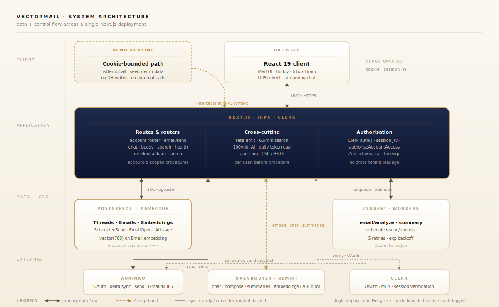

# VectorMail Architecture

A working note for engineers joining the codebase. Read this once; the code is the source of truth after.

## Shape

Single deployment. Single Postgres with pgvector. One auth (Clerk). One email gateway (Aurinko). No separate vector store.

## Layers

| Layer            | Where                              | Responsibility                                                                |
| ---------------- | ---------------------------------- | ----------------------------------------------------------------------------- |
| App routes       | `src/app/**`                       | Next.js pages and route handlers (REST endpoints).                            |
| tRPC routers     | `src/server/api/routers/**`        | Typed RPC for the UI. `protectedProcedure` enforces Clerk auth.               |
| Business logic   | `src/lib/**`                       | Sync, search, embeddings, automation, demo data. Pure-ish modules.            |
| Background jobs  | `src/lib/inngest/**`               | Inngest workers for embeddings/analysis and scheduled sends.                  |
| Demo runtime     | `src/lib/demo/**` + cookie         | Cookie-driven demo state; in-memory seed data; no DB writes.                  |
| Eval             | `src/__tests__/eval/**`            | Pinned-behavior tests for intent detection, confidence policy, demo routing.  |

## Key data flows

### 1. Mail sync (Aurinko → Postgres)
- First sync: full window (`syncLatestEmails` in `src/lib/mail-sync-inbox-step.ts`).
- Subsequent: delta-token-driven via stored `Account.syncDeltaToken`.
- Concurrency: one sync per account, gated by `src/lib/sync-lock.ts` (Upstash Redis or local).
- After sync, threads/emails are upserted with `internetMessageId` UNIQUE - duplicates impossible.

### 2. Semantic search
- Query → `generateQueryEmbedding` (Gemini, 768-dim) → `db.$queryRaw` against `Email.embedding` with pgvector `<=>`.
- Filters by `accountId` first (no cross-tenant leakage).
- If embedding fails or returns empty, falls back to text search in the same procedure.
- See `src/lib/vector-search.ts`.

### 3. Inbox Brain chat
- `POST /api/chat` (in `src/app/api/chat/`).
- Clerk auth → per-user rate limit (`checkUserRateLimit`) → daily token cap (`checkDailyCap`).
- Intent detection (`src/lib/intent-detection.ts`) routes to SEARCH / SUMMARIZE / SELECT.
- Vector search → prompt build → OpenRouter stream.
- Token usage recorded into `AiUsage` per operation.

### 4. Auto-follow-up engine
- Detector runs against `awaiting_approval` candidates.
- Confidence band gate is a single source of truth: `src/lib/automation/policy.ts`.
- Mode × band → status transition (`decisionForModeAndConfidence`).
- Audit-logged transitions.

### 5. Scheduled sends
- UI inserts a row in `ScheduledSend`.
- Cron endpoint at `/api/cron/process-scheduled-sends` (auth via `CRON_SECRET`).
- Cron enqueues one Inngest job per due row; the worker performs the actual send.
- If Inngest is down, sync and `getThreads` are unaffected.

### 6. Demo mode
- Entry: `/api/demo/enter` sets `vectormail_demo` cookie (24-hour TTL) and redirects to `/mail`.
- Cookie wins over Clerk auth in both `useDemoMode` and `createTRPCContext` so a logged-in user clicking "See it in action" still sees seeded data.
- Demo procedures branch on `ctx.auth.userId === DEMO_USER_ID && input.accountId === DEMO_ACCOUNT_ID` and return seeded data without touching the DB.
- Future: consolidate into a `demoRepository` adapter to remove the per-procedure branches.

## Cross-cutting concerns

- **Rate limit** at procedure boundary: search 60/min, AI 100/min. Returns 429 with `Retry-After`.
- **Daily AI cap**: optional via `AI_DAILY_CAP_TOKENS`; over-cap audit-logs an `ai_cap_exceeded` event.
- **Audit log** in `src/lib/audit/audit-log.ts` for sensitive transitions (mode change, cap exceeded, action approval).
- **Correlation IDs**: `src/lib/correlation.ts`; every tRPC call carries a `requestId` into structured logs.
- **Structured logs**: `src/lib/logging/server-logger.ts` (pino). `console.*` is the wrong call - use `serverLog`.
- **Idempotency**: action executions deduplicate within a window via `idempotencyKey` so re-running the detector doesn't double-queue.

## Decisions worth knowing

See `docs/adr/` for the why behind each.

| ADR  | Decision                                          |
| ---- | ------------------------------------------------- |
| 0001 | Use Postgres + pgvector instead of a managed VDB  |
| 0002 | Use Aurinko instead of direct Gmail API           |
| 0003 | Use Inngest for jobs instead of a separate worker |

## What lives where (most-used)

| Need to do                       | File                                                              |
| -------------------------------- | ----------------------------------------------------------------- |
| Add an inbox UI feature          | `src/components/mail/**` + a new procedure in `account.ts`        |
| Modify sync                      | `src/lib/accounts.ts`, `src/lib/mail-sync-inbox-step.ts`          |
| Modify search                    | `src/lib/vector-search.ts` (keep the text-search fallback)        |
| Add an AI feature                | OpenRouter call → `recordUsage` → rate-limit. Never block the UI. |
| Wire a new automation transition | `src/lib/automation/policy.ts` + `src/lib/automation/transitions.ts` |
| Add demo data                    | `src/lib/demo/seed-demo-data.ts`                                  |
| Add an eval                      | `src/__tests__/eval/*.eval.ts` then `npm run test:eval`           |

## Known follow-ups

These are tracked as cleanup work, not blockers:

1. **Continue `account.ts` decomposition.** Labels are already split into
   `account-procedures/labels.ts`. Remaining work: extract events
   (`getEventForThread`, `getUpcomingEventsFromEmails`,
   `saveEventToCalendarList`), identity (`getAccounts`, `getMyAccount`,
   `getSendingIdentity`), and compose (`sendEmail`, `scheduleSend`)
   procedure groups using the same `...spread` pattern.
2. **Decompose `accounts.ts` (sync engine).** The 2,400-LOC class can be
   split by phase (delta sync, full sync, retry, send) into separate
   modules under `src/lib/accounts/`.
3. **Decompose `ThreadList.tsx` (2,200 LOC).** Extract focus-filter
   logic, bulk-actions toolbar, and account picker into sibling files.

## Things to never do

1. Bypass `protectedProcedure` for any data-touching endpoint.
2. Inline the confidence numbers (0.85 / 0.6) anywhere outside `policy.ts`.
3. Run two syncs for the same account in parallel.
4. Block the UI thread on an AI call. Always stream or background.
5. Insert demo data into Postgres. Demo is in-memory only.
6. Wrap `<ClerkProvider>` inside a `"use client"` file. It must stay server-rendered.
